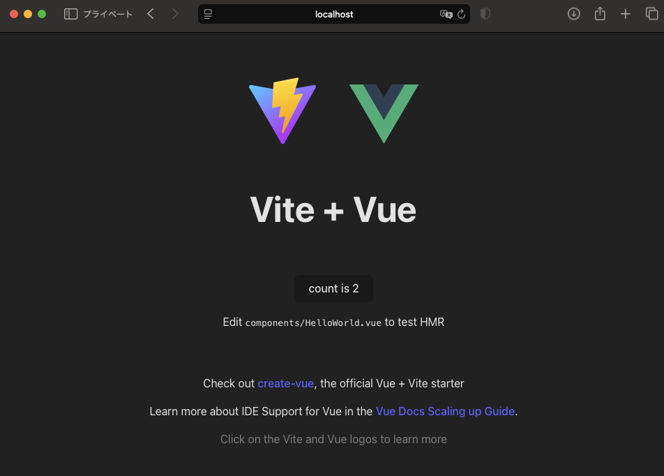
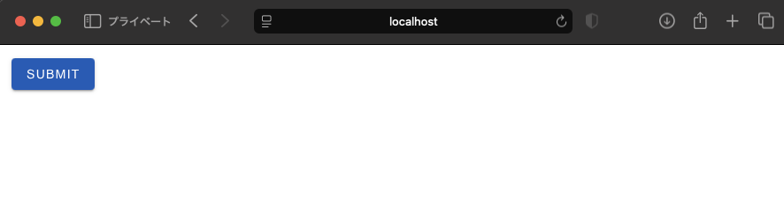

# None

## アーキテクチャ
- npm
- Vite
- Vue3
- TypeScript
- Vuetify
- Vue Router

## 1. nvmでnodeのインストール
1. nvmインストール
```shell
curl -o- https://raw.githubusercontent.com/nvm-sh/nvm/v0.40.1/install.sh | bash
```
2. 最新のnodeをインストール
```shell
nvm install node 
```
3. 現在のnodeを確認
```shellgit a
nvm current
```

## 2. Viteのインストール
```shell
npm install -g create-vite
```

## 3. プロジェクト設定
1.プロジェクト作成
```shell
npm init vite@latest vue3-ts-vuetify -- --template vue-ts
```

2. プロジェクトディレクトリへ移動し、依存関係をインストール
```shell
cd vue3-ts-vuetify
npm install
```

3. ローカル環境で実行
```
npm run dev
```


## 4. Vuetifyの導入
1. Vuetifyのインストール
```
npm install vuetify@latest
```

2. Vuetifyのセットアップ
2.1. 以下の内容のsrc/plugins/vuetify.tsを作成する。
※ pluginsフォルダは作成する。    
```typescript
import 'vuetify/styles'
import { createVuetify } from 'vuetify'
import * as components from 'vuetify/components'
import * as directives from 'vuetify/directives'

export default createVuetify({
  components,
  directives,
})
```

3. 以下の内容のsrc/global.d.tsを作成する。
```typescript
declare module 'vuetify/styles'
declare module 'vuetify/lib/components'
declare module 'vuetify/lib/directives'
```

4. src/main.tsを以下の内容に書き換える。
```typescript
import { createApp } from 'vue'
import vuetify from './plugins/vuetify'
import App from './App.vue'

const app = createApp(App)

app.use(vuetify)
app.mount('#app')
```

5. src/App.vueを以下の内容に書き変える
```vue
<template>
  <v-container>
    <v-btn type="submit" color="primary">submit</v-btn>
  </v-container>
</template>

<script lang="ts">
import { defineComponent } from 'vue'

export default defineComponent({
  name: 'App',
})

</script>
```

6. 実行確認
```
npm run dev
```


## 5. Vue Routerの導入
1. Vue Routerのインストール
```shell
npm install vue-router
```

2. Home画面とSub画面を作成
- src/viewsフォルダを作成する
- 以下の内容のHomeView.vueを作成する
```vue
<template>
  <v-container>
    <h1>Home 画面</h1>
    <p>ここはホームです</p>
    <v-btn color="primary" @click="goToSub">Sub 画面へ</v-btn>
  </v-container>
</template>

<script lang="ts">
import { defineComponent } from 'vue'
import { useRouter } from 'vue-router'

export default defineComponent({
  name: 'HomeView',
  setup() {
    const router = useRouter()
    const goToSub = () => {
      router.push({ name: 'Sub' })
    }
    return {
      goToSub,
    }
  },
})
</script>

<style scoped>
</style>
```

- 以下の内容のSubView.vueを作成する
```vue
<template>
  <v-container>
    <h1>Sub 画面</h1>
    <p>Sub 画面です。</p>
    <v-btn color="secondary" @click="goHome">Home へ戻る</v-btn>
  </v-container>
</template>

<script lang="ts">
import { defineComponent } from 'vue'
import { useRouter } from 'vue-router'

export default defineComponent({
  name: 'SubView',
  setup() {
    const router = useRouter()
    const goHome = () => {
      router.push({ name: 'Home' })
    }
    return {
      goHome,
    }
  },
})
</script>

<style scoped>
</style>

```

3. ルーティングの設定
- 以下の内容のscr/router/index.tsを作成する。
```typescript
import { createRouter, createWebHistory } from 'vue-router'
import HomeView from '../views/HomeView.vue'
import SubView from '../views/SubView.vue'

const routes = [
  {
    path: '/',
    name: 'Home',
    component: HomeView,
  },
  {
    path: '/Sub',
    name: 'Sub',
    component: SubView,
  },
]

const router = createRouter({
  history: createWebHistory(import.meta.env.BASE_URL),
  routes,
})

export default router
```

4.  App.vueの修正
- App.vueを以下の内容に書き換える
```vue
<template>
  <v-app>
    <router-view></router-view>
  </v-app>
</template>

<script lang="ts">
import { defineComponent } from 'vue'

export default defineComponent({
  name: 'App',
})
</script>
```

5. main.tsを修正
```typescript
import { createApp } from 'vue'
import vuetify from './plugins/vuetify'
import router from './router' // 追加
import App from './App.vue'

const app = createApp(App)

app.use(vuetify)
app.use(router) // 追加
app.mount('#app')
```

6. 実行確認
```shell
npm run dev
```