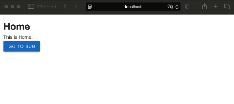
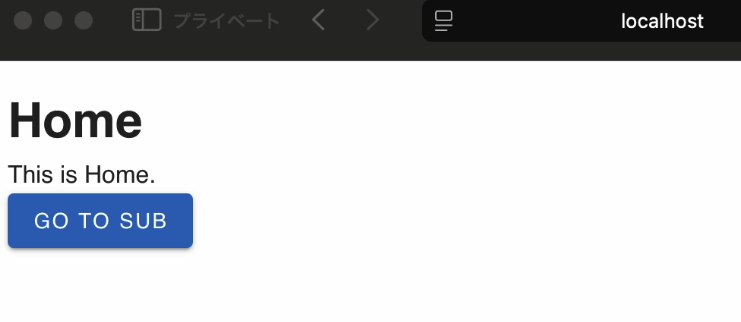

[日本語](README_ja.md)

# Vue3 + TypeScript + Vue Router + Vuetify

A simple environment using Vue3, TypeScript, Vuetify, and Vue Router.



- npm
- Vite
- Vue3
- TypeScript
- Vuetify
- Vue Router

## How to Use

1. Clone this repository:
```shell
git clone git@github.com:flappan/vue3-ts-vuetify-router.git
```

2. Install dependencies:
```shell
npm install
```

3. Run in development mode:
```shell
npm run dev
```

4. Build:
```shell
npm run build
```

# How Was This Created?
## 1. Install Node using nvm
1. Install nvm:
```shell
curl -o- https://raw.githubusercontent.com/nvm-sh/nvm/v0.40.1/install.sh | bash
```
2. Install the latest Node:
```shell
nvm install node 
```
3. Check the current Node version:
```shellgit a
nvm current
```

## 2. Install Vite
```shell
npm install -g create-vite
```

## 3. Project Setup
1. Create the project:
```shell
npm init vite@latest vue3-ts-vuetify -- --template vue-ts
```

2. Move to the project directory and install dependencies:
```shell
cd vue3-ts-vuetify
npm install
```

3. Run locally:
```
npm run dev
```


## 4. Introduce Vuetify
1. nstall Vuetify:
```
npm install vuetify@latest
```

2. Set up Vuetify
- Create src/plugins/vuetify.ts with the following content:
```typescript
import 'vuetify/styles'
import { createVuetify } from 'vuetify'
import * as components from 'vuetify/components'
import * as directives from 'vuetify/directives'

export default createVuetify({
  components,
  directives,
})
```

3. Create src/global.d.ts with the following content:
```typescript
declare module 'vuetify/styles'
declare module 'vuetify/lib/components'
declare module 'vuetify/lib/directives'
```

4. Rewrite src/main.ts as follows:
```typescript
import { createApp } from 'vue'
import vuetify from './plugins/vuetify'
import App from './App.vue'

const app = createApp(App)

app.use(vuetify)
app.mount('#app')
```

5. Rewrite src/App.vue as follows:
```vue
<template>
  <v-container>
    <v-btn type="submit" color="primary">submit</v-btn>
  </v-container>
</template>

<script lang="ts">
import { defineComponent } from 'vue'

export default defineComponent({
  name: 'App',
})

</script>
```

6. Run to confirm:
```
npm run dev
```


## Introduce Vue Router
1. Install Vue Router:
```shell
npm install vue-router
```

2. Create Home and Sub screens
- Create the src/views folder.
- Create src/views/HomeView.vue with the following content:
```vue
<template>
  <v-container>
    <h1>Sub</h1>
    <p>This is the Sub Screen.</p>
    <v-btn color="secondary" @click="goHome">Go Back to Home</v-btn>
  </v-container>
</template>

<script lang="ts">
import { defineComponent } from 'vue'
import { useRouter } from 'vue-router'

export default defineComponent({
  name: 'HomeView',
  setup() {
    const router = useRouter()
    const goToSub = () => {
      router.push({ name: 'Sub' })
    }
    return {
      goToSub,
    }
  },
})
</script>

<style scoped>
</style>
```

- Create src/views/SubView.vue with the following content:
```vue
<template>
  <v-container>
    <h1>Sub</h1>
    <p>This is the Sub Screen.</p>
    <v-btn color="secondary" @click="goHome">Go Back to Home</v-btn>
  </v-container>
</template>

<script lang="ts">
import { defineComponent } from 'vue'
import { useRouter } from 'vue-router'

export default defineComponent({
  name: 'SubView',
  setup() {
    const router = useRouter()
    const goHome = () => {
      router.push({ name: 'Home' })
    }
    return {
      goHome,
    }
  },
})
</script>

<style scoped>
</style>

```

3. Routing Settings
- Create src/router/index.ts with the following content:
```typescript
import { createRouter, createWebHistory } from 'vue-router'
import HomeView from '../views/HomeView.vue'
import SubView from '../views/SubView.vue'

const routes = [
  {
    path: '/',
    name: 'Home',
    component: HomeView,
  },
  {
    path: '/Sub',
    name: 'Sub',
    component: SubView,
  },
]

const router = createRouter({
  history: createWebHistory(import.meta.env.BASE_URL),
  routes,
})

export default router
```

4.  Modify App.vue
- Rewrite App.vue as follows:
```vue
<template>
  <v-app>
    <router-view></router-view>
  </v-app>
</template>

<script lang="ts">
import { defineComponent } from 'vue'

export default defineComponent({
  name: 'App',
})
</script>
```

5. Modify main.ts:
```typescript
import { createApp } from 'vue'
import vuetify from './plugins/vuetify'
import router from './router' // Added
import App from './App.vue'

const app = createApp(App)

app.use(vuetify)
app.use(router) // Added
app.mount('#app')
```

6. Confirm it runs:
```shell
npm run dev
```
